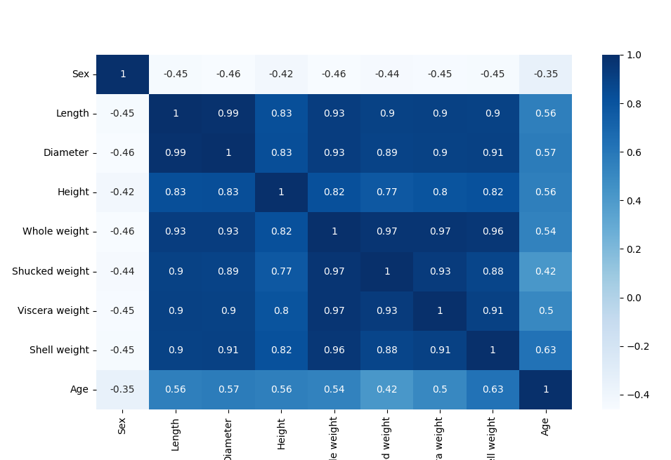
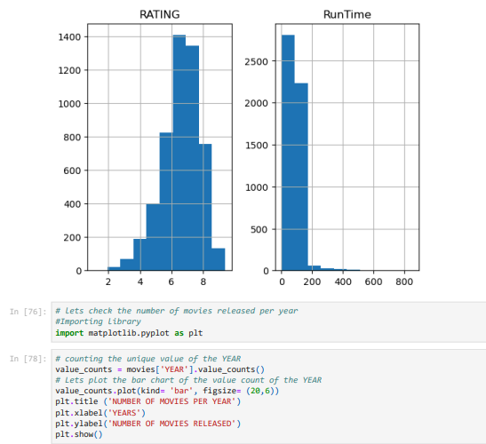

# Data Science Portfolio

Welcome to my Data Science Portfolio! 👋 I'm **Mobolaji Abdulateef**, I am an expert in Data Analysis, visualization, and predictive modelling using **Python** and **PowerBI** This portfolio showcases projects demonstrating my skills, creativity, and ability to turn data into actionable insights and predictive models.

---
## 📜 About Me

I am a Data Scientist and Biomedical Research Enthusiast with a strong interest in solving real-world problems in health care through data, sustainable development, and advanced analytics. I aim to leverage data science to drive innovation and make informed decisions in health care.

---
## 🛠️ Skills

- **Programming Languages:** Python
- **Machine Learning:** Scikit-learn, TensorFlow, PyTorch
- **Data Visualization:** Matplotlib and Seaborn
- **Other Tools:** Git, Jupyter Notebooks

---

## 📊 Projects

### 1. ABALONE AGE PREDICTION
- **Description:** 
Abalone age prediction involves estimating the age of abalones, and marine molluscs, using measurable physical features instead of traditional ring counting, which is labour-intensive. Key features include shell dimensions (length, diameter, height), weight metrics (whole, shucked, viscera, and shell weight), and sex (male, female, or infant). Machine learning models, trained on datasets like the UCI Abalone Dataset, use these features to predict age accurately. This method supports sustainable fisheries by enabling efficient population management and conservation efforts. Streamlining age estimation facilitates better resource management, promoting ecological balance and aiding in the sustainable harvesting of abalone populations.

- **Tools & Technologies:** Python, Pandas, Scikit-learn, Matplotlib

- 
-

---

### 2. Data Cleaning Task with Python
- **Description:** In this project, I performed a data cleaning task on a dataset containing information about movies watched over a specific period. The dataset, sourced from Kaggle, includes attributes such as movie titles, genres, ratings, watch duration, and timestamps. The primary goal of this task was to ensure the dataset was clean, consistent, and ready for analysis by addressing missing values, duplicate entries, inconsistent formatting, and incorrect data types. Using Python and its powerful libraries such as Pandas and NumPy, I streamlined the cleaning process and prepared the data for further analysis. This project showcases the importance of data cleaning as a foundational step in data science, ensuring accuracy and reliability in downstream insights and visualizations.
- 
- **Tools & Technologies:** Python, Matplotlib, Panda and Seaborn

- 

  
- **Repository:** [Download Jupyter Notebook](Data Cleaning Task_ Movies.ipynb)
- **Download Data** [Here](movies.csv)
---
### 3. Amazon Social Media Marketing in Nigeria
- **Description:** The data visualization was performed using Power BI, a dynamic tool for creating interactive and comprehensive representations of the survey results. Key metrics such as customer engagement, platform preferences, content effectiveness, and purchasing behaviours were analyzed to understand how Amazon's social media presence influences Nigerian customers.
The insights derived from the visualization offer a window into customer preferences, highlighting trends such as the popularity of specific platforms like Instagram and Twitter, the role of promotional campaigns, and the importance of localized content in driving engagement. This study provides valuable information for refining Amazon’s marketing strategies, optimizing customer experiences, and enhancing its reach in the Nigerian market.
- 
- **Tools & Technologies:** PowerBI Visualization

  
- **Repository:** [Download Jupyter Notebook](Social Media Marketing Survey.pbix)
- **Download Data** [Here](Social Media Marketing Survey.pbix)
---

## 📬 Contact Me

Feel free to reach out to me via:
- **Email:** mobolajiayoola3@gmail.com
- **LinkedIn:** [Check my LinkedIn activities](https://www.linkedin.com/in/mobolajiabdulateef/) 
- **GitHub:** [View](https://github.com/Iamoptimistic)
- **Curriculum Vitae:** [Open](CURRICULUM VITAE- ABDULATEEF AYOOLA MOBOLAJI.pdf)

---

## 🌟 Acknowledgments

I appreciate everyone who has guided and supported me in my journey. Special thanks to my mentors, collaborators, and the data science community!

---

✨ **Mobolaji Abdulateef** ✨
