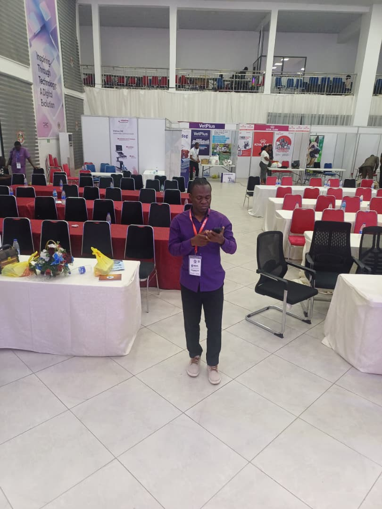
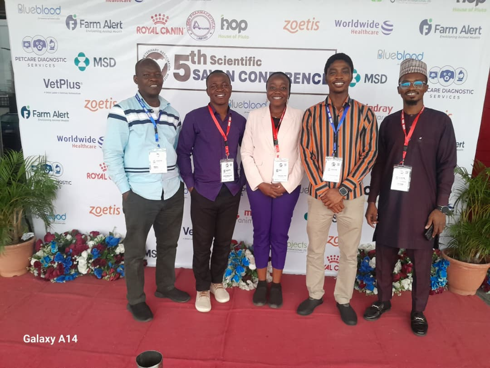
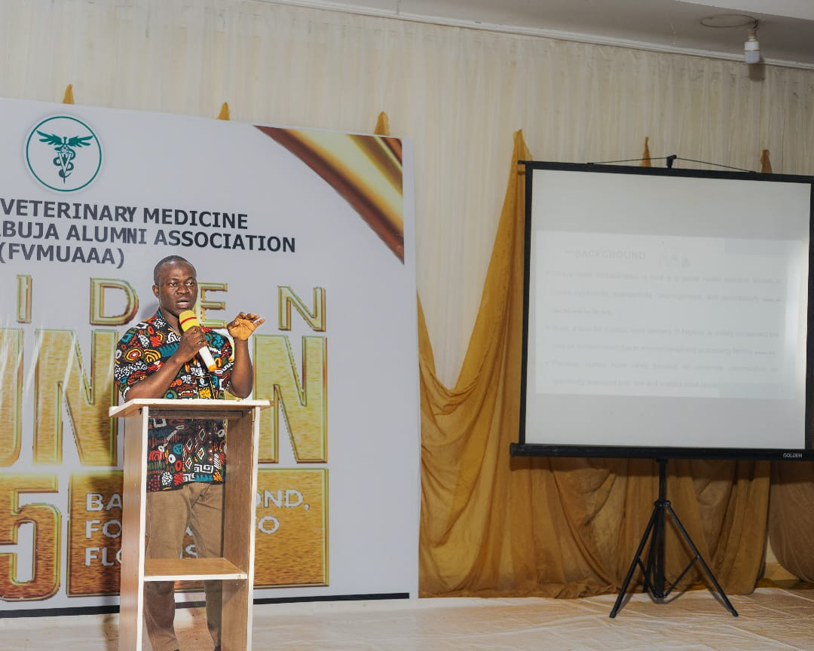
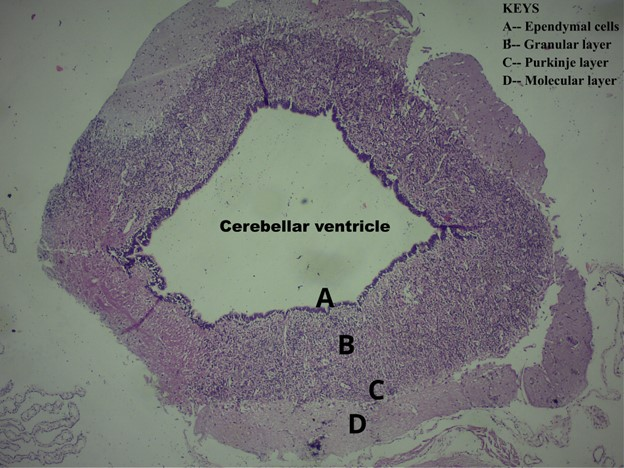
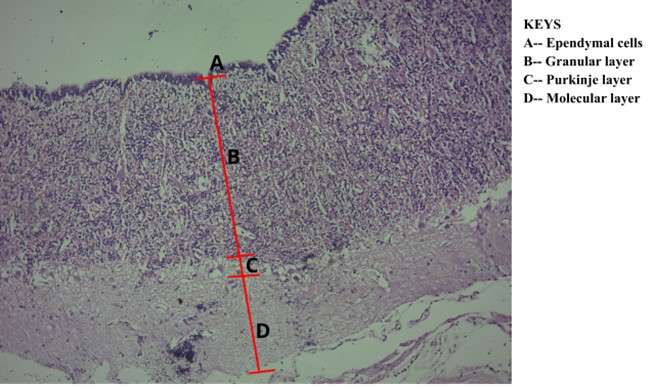

<!DOCTYPE html>
<html lang="en">
<head>
  <meta charset="UTF-8">
  <meta name="viewport" content="width=device-width, initial-scale=1.0">
  <title>Mobolaji Abdulateef | Data Science Portfolio</title>
  
  
</head>
<body class="font-sans">

  <!-- Navigation -->
  <header class="shadow-md fixed top-0 w-full z-50">
    <nav class="container mx-auto flex justify-between items-center p-4">
      

        
        <h1 class="text-xl font-bold text-white">Mobolaji Abdulateef</h1>
      

      <ul class="flex space-x-6 font-medium">
        <li><a href="#home" class="nav-link">Home</a></li>
        <li><a href="#portfolio" class="nav-link">Portfolio</a></li>
        <li><a href="#gallery" class="nav-link">Gallery</a></li>
        <li><a href="#artwork" class="nav-link">My Artwork</a></li>
        <li><a href="#contact" class="nav-link">Contact</a></li>
      </ul>
    </nav>
  </header>

  <!-- Hero -->
  <section id="home" class="text-center pt-28">
    

      <h2 class="text-5xl font-extrabold mb-6 text-blue-600">Welcome to My Portfolio</h2>
      

        I am <strong>Mobolaji Abdulateef</strong>, a veterinarian and certified Data scientist with keen interest in Biomedical Research. 
      My research focus include neurobiology, bioimaging and environmental toxicology.
      

      <a href="#portfolio" class="bg-blue-600 text-white px-6 py-3 rounded-lg shadow hover:bg-blue-700 font-semibold">
        Explore My Work
      </a>
    

  </section>

  <!-- Portfolio -->
  <section id="portfolio">
    

      <h2 class="text-4xl font-bold mb-4 text-blue-600">📊 Portfolio Projects</h2>
      
A selection of my work demonstrating expertise in machine learning, predictive analytics, and data visualization.

    

    

      <button class="scroll-btn left-btn" onclick="scrollContent('portfolioContainer', -300)">◀</button>
      

        

          <h3 class="text-xl font-semibold mb-2">Employee Promotion Prediction</h3>
          
ML system to predict employee promotions using HR metrics, enhancing transparency and fairness.

          
        

        

          <h3 class="text-xl font-semibold mb-2">Abalone Age Prediction</h3>
          
Predicting the age of abalones using measurable physical features and machine learning models.

          
        

        <!-- add more cards here if needed -->
      

      <button class="scroll-btn right-btn" onclick="scrollContent('portfolioContainer', 300)">▶</button>
    

  </section>

  <!-- Gallery -->
  <section id="gallery">
    

      <h2 class="text-4xl font-bold mb-4 text-blue-600">🖼️ Gallery</h2>
      
Browse through visuals from my projects, research and conferences.

    

    

      <button class="scroll-btn left-btn" onclick="scrollContent('galleryContainer', -300)">◀</button>
      

        

          
          
SAVAN Conference Day 1

        

        

          
          
SAVAN Conference Day 2

        

        

          
          
SAVAN Conference with BlueBlood Veterinary Hospital Staff

        

        

          
          
Presented my research work at the maiden edition of the Alumni meeting

        

      

      <button class="scroll-btn right-btn" onclick="scrollContent('galleryContainer', 300)">▶</button>
    

  </section>

  <!-- Artwork -->
  <section id="artwork">
    

      <h2 class="text-4xl font-bold mb-4 text-blue-600">🎨 My Artwork</h2>
      
Microscope images and scientific visuals from my biomedical research.

    

    

      <button class="scroll-btn left-btn" onclick="scrollContent('artworkContainer', -300)">◀</button>
      

        

          
          
Transverse section of Cerebellum of African Side-neck Turtle (Pelusios castaneus) (X40, H&E)

        

        

          
          
ransverse section of Cerebellum (Pelusios castaneus) (X100, H&E)

        

        

          
          
Transverse section of Cerebellum (Pelusious castaneus) (X400, H&E)

        

        

          
          
Transverse section of Stomach showing sloughing-off of the intestinal lining (X100, H&E)

        

        

          
          
longitudinal Section of Cardiac muscle, note the crossing intercalated disc, nucleus at the margin and branching of the muscle fibers (X100, H&E)

        

      

      <button class="scroll-btn right-btn" onclick="scrollContent('artworkContainer', 300)">▶</button>
    

  </section>

  <!-- Contact -->
  <section id="contact">
    

      <h2 class="text-4xl font-bold mb-6 text-blue-600">📬 Contact Me</h2>
      
Let’s connect! Reach out for collaborations, opportunities, or just to say hi.

      

        
Email: <a href="mailto:mobolajiayoola3@gmail.com">mobolajiayoola3@gmail.com</a>

        
LinkedIn: <a href="https://www.linkedin.com/in/mobolajiabdulateef/">LinkedIn Profile</a>

        
GitHub: <a href="https://github.com/Iamoptimistic">GitHub</a>

      

      <h3 class="text-2xl font-bold mb-4 text-blue-600">📄 Curriculum Vitae</h3>
      
Download my complete CV to learn more about my academic background, professional journey, and technical expertise.

      <a href="CURRICULUM VITAE- ABDULATEEF AYOOLA MOBOLAJI.pdf" class="bg-blue-600 text-white px-6 py-3 rounded-lg shadow hover:bg-blue-700">Download CV</a>
    

  </section>

  <!-- Footer -->
  <footer class="py-6 text-center">
    
✨ Built by <strong class="text-blue-300">Mobolaji Abdulateef</strong> | Data Science & Biomedical Research ✨

  </footer>

  <!-- Lightbox -->
  

    

      
      

    

  

  
</body>
</html>
