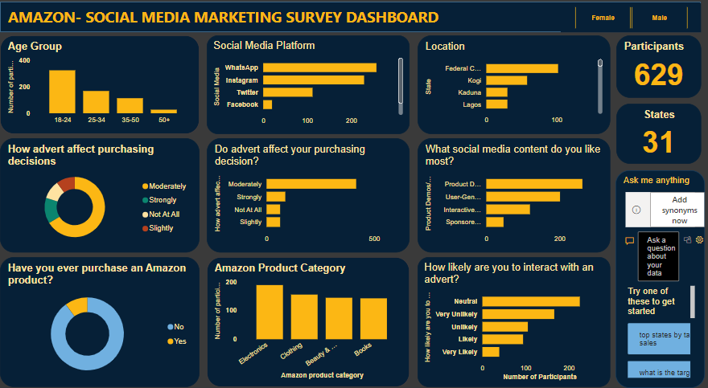

<!DOCTYPE html>
<html lang="en">
<head>
  <meta charset="UTF-8">
  <meta name="viewport" content="width=device-width, initial-scale=1.0">
  <title>Mobolaji Abdulateef | Data Science Portfolio</title>
  
  
</head>
<body class="bg-gray-50 text-gray-900 font-sans">
  <!-- Navigation Bar -->
  <header class="bg-white shadow-md fixed top-0 w-full z-50">
    <nav class="container mx-auto flex justify-between items-center p-4">
      <h1 class="text-xl font-bold text-blue-600">Mobolaji Abdulateef</h1>
      <ul class="flex space-x-6 font-medium">
        <li><a href="#home" class="hover:text-blue-500">Home</a></li>
        <li><a href="#portfolio" class="hover:text-blue-500">Portfolio</a></li>
        <li><a href="#research" class="hover:text-blue-500">Research</a></li>
        <li><a href="#gallery" class="hover:text-blue-500">Gallery</a></li>
        <li><a href="#cv" class="hover:text-blue-500">CV</a></li>
        <li><a href="#contact" class="hover:text-blue-500">Contact</a></li>
      </ul>
    </nav>
  </header>

  <!-- Hero Section -->
  <section id="home" class="pt-32 pb-20 bg-gradient-to-r from-blue-600 to-indigo-600 text-white">
    

      <h2 class="text-5xl font-extrabold mb-6">Welcome to My Portfolio</h2>
      
I am <strong>Mobolaji Abdulateef</strong>, a Data Scientist and Biomedical Research Enthusiast. I specialize in <strong>Data Analysis, Visualization, and Predictive Modelling</strong> using Python and Power BI.

      <a href="#portfolio" class="bg-white text-blue-700 px-6 py-3 rounded-lg shadow hover:bg-gray-100 font-semibold">Explore My Work</a>
    

  </section>

  <!-- Portfolio Section -->
  <section id="portfolio" class="py-20">
    

      <h2 class="text-4xl font-bold mb-4">📊 Portfolio Projects</h2>
      
A selection of my work demonstrating expertise in machine learning, predictive analytics, and data visualization.

    

    

      

        <h3 class="text-xl font-semibold mb-2">Employee Promotion Prediction</h3>
        
ML system to predict employee promotions using HR metrics, enhancing transparency and fairness.

        
      

      

        <h3 class="text-xl font-semibold mb-2">Abalone Age Prediction</h3>
        
Predicting the age of abalones using measurable physical features and machine learning models.

        
      

      

        <h3 class="text-xl font-semibold mb-2">Data Cleaning Task with Python</h3>
        
Prepared and cleaned a Kaggle movies dataset, resolving missing values, duplicates, and inconsistencies.

        
      

      

        <h3 class="text-xl font-semibold mb-2">Amazon Social Media Marketing</h3>
        
Power BI visualization of Amazon’s marketing influence in Nigeria, analyzing customer engagement trends.

        
      

    

  </section>

  <!-- Research Section -->
  <section id="research" class="py-20 bg-gray-100">
    

      <h2 class="text-4xl font-bold mb-4">📑 Research Interests</h2>
      
My research lies at the intersection of healthcare, sustainable development, and computational neuroscience. I use advanced analytics to study antimicrobial resistance, mental health, sleep patterns, and diagnostic imaging.

    

    

      

        <h3 class="text-xl font-semibold mb-2">Biomedical Research</h3>
        
Applying machine learning to healthcare datasets for better decision-making, diagnostics, and patient outcomes.

      

      

        <h3 class="text-xl font-semibold mb-2">Sustainable Development</h3>
        
Exploring data-driven policies for antimicrobial resistance, public health, and sustainable healthcare systems.

      

    

  </section>

  <!-- Gallery Section -->
  <section id="gallery" class="py-20">
    

      <h2 class="text-4xl font-bold mb-4">🖼️ Gallery</h2>
      
A collection of visuals from my data projects and research.

    

    

      
      
      
    

  </section>

  <!-- CV Section -->
  <section id="cv" class="py-20 bg-gray-100">
    

      <h2 class="text-4xl font-bold mb-4">📄 Curriculum Vitae</h2>
      
Download my complete CV to learn more about my academic background, professional journey, and technical expertise.

      <a href="CURRICULUM VITAE- ABDULATEEF AYOOLA MOBOLAJI.pdf" class="bg-blue-600 text-white px-6 py-3 rounded-lg shadow hover:bg-blue-700">Download CV</a>
    

  </section>

  <!-- Contact Section -->
  <section id="contact" class="py-20">
    

      <h2 class="text-4xl font-bold mb-6">📬 Contact Me</h2>
      
Let’s connect! Reach out for collaborations, opportunities, or just to say hi.

      

        
Email: <a href="mailto:mobolajiayoola3@gmail.com" class="text-blue-600">mobolajiayoola3@gmail.com</a>

        
LinkedIn: <a href="https://www.linkedin.com/in/mobolajiabdulateef/" class="text-blue-600">LinkedIn Profile</a>

        
GitHub: <a href="https://github.com/Iamoptimistic" class="text-blue-600">GitHub</a>

      

    

  </section>

  <!-- Footer -->
  <footer class="bg-gray-800 text-white py-6 text-center">
    
✨ Built by <strong>Mobolaji Abdulateef</strong> | Data Science & Biomedical Research ✨

  </footer>
</body>
</html>
